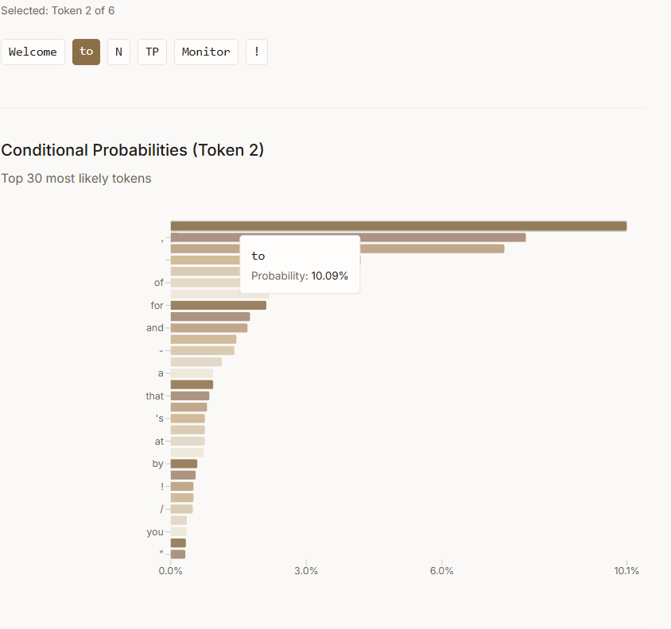

# Next Token Prediction Monitor

A minimalist, fast web application for monitoring next-token-prediction probability distributions of LLMs.

<p align="center">
  
</p>


## Features

- **Model Loading**: Load any HuggingFace model or custom models with modified weights (.pt files)
- **Token Visualization**: Clear token demarcation using the model's tokenizer
- **Conditional Probabilities**: Click on tokens to see conditional probability distributions
- **Probability Charts**: Interactive bar charts showing top token predictions

## Quickstart

Please ensure you already have npm installed. Then, make the shell script executable, and run it.
```bash
chmod +x start.sh
./start.sh
```
The API will be available at `http://localhost:3000` for playing around.

## Project Structure

```
monitor-ntp/
├── backend/          # FastAPI backend
│   ├── main.py      # API endpoints and model loading
│   └── requirements.txt
├── frontend/         # React frontend
│   ├── src/
│   │   ├── components/
│   │   │   ├── ModelLoader.jsx
│   │   │   ├── TextEditor.jsx
│   │   │   └── ProbabilityChart.jsx
│   │   ├── App.jsx
│   │   └── main.jsx
│   └── package.json
└── README.md
```

## Usage

1. **Load a Model**:
   - Enter a HuggingFace model ID (e.g., `gpt2`, `distilgpt2`, `microsoft/DialoGPT-small`)
   - Optionally provide a path to custom weights (.pt file) [WIP]
   - Click "Load Model"

2. **Using the Application**:
   - Type or paste text into the text field
   - Tokens will be automatically tokenized and displayed below the text area
   - Click on any token to see the conditional probability distribution
   - The chart shows what the model predicted at that position given the previous context
   - Click the same token again to deselect it

## Custom Models [WIP]

To use custom modified models:

1. Save your modified model weights as a `.pt` file
2. When loading the model, provide:
   - **Model Path**: The base HuggingFace model ID
   - **Custom Weights Path**: Path to your `.pt` file

The system will load the base model and then apply your custom weights.

## Built With

- **Backend**: FastAPI, PyTorch, Transformers
- **Frontend**: React, Vite, Tailwind CSS, Recharts

## Notes

- Ensure you have CUDA available if using GPU acceleration. I may or may not work on getting an actual cloud support.
- If CUDA is available, then I default to fp16.